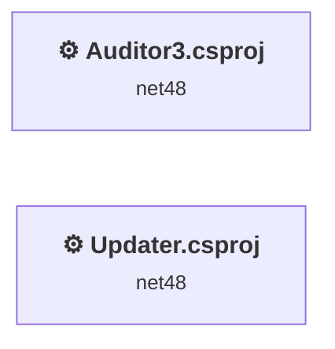
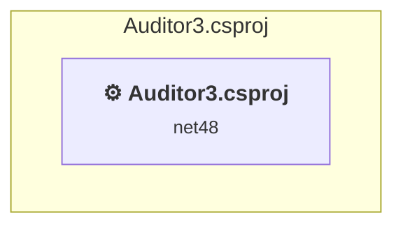
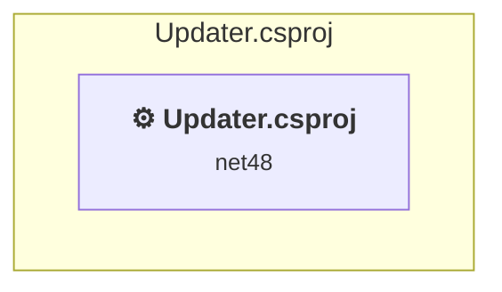

# Projects and dependencies analysis

This document provides a comprehensive overview of the projects and their dependencies in the context of upgrading to .NETCoreApp,Version=v9.0.

## Table of Contents

- [Executive Summary](#executive-Summary)
  - [Highlevel Metrics](#highlevel-metrics)
  - [Projects Compatibility](#projects-compatibility)
  - [Package Compatibility](#package-compatibility)
  - [API Compatibility](#api-compatibility)
- [Aggregate NuGet packages details](#aggregate-nuget-packages-details)
- [Top API Migration Challenges](#top-api-migration-challenges)
  - [Technologies and Features](#technologies-and-features)
  - [Most Frequent API Issues](#most-frequent-api-issues)
- [Projects Relationship Graph](#projects-relationship-graph)
- [Project Details](#project-details)

  - [Auditor3\Auditor3.csproj](#auditor3auditor3csproj)
  - [Updater\Updater.csproj](#updaterupdatercsproj)

## Executive Summary

### Highlevel Metrics

| Metric | Count | Status |
| :--- | :---: | :--- |
| Total Projects | 2 | All require upgrade |
| Total NuGet Packages | 3 | 2 need upgrade |
| Total Code Files | 74 |  |
| Total Code Files with Incidents | 29 |  |
| Total Lines of Code | 10089 |  |
| Total Number of Issues | 1280 |  |
| Estimated LOC to modify | 1273+ | at least 12.6% of codebase |

### Projects Compatibility

| Project | Target Framework | Difficulty | Package Issues | API Issues | Est. LOC Impact | Description |
| :--- | :---: | :---: | :---: | :---: | :---: | :--- |
| [Auditor3\Auditor3.csproj](#auditor3auditor3csproj) | net48 | 🟡 Medium | 3 | 1273 | 1273+ | ClassicWpf, Sdk Style = False |
| [Updater\Updater.csproj](#updaterupdatercsproj) | net48 | 🟢 Low | 0 | 0 |  | ClassicDotNetApp, Sdk Style = False |

### Package Compatibility

| Status | Count | Percentage |
| :--- | :---: | :---: |
| ✅ Compatible | 1 | 33.3% |
| ⚠️ Incompatible | 0 | 0.0% |
| 🔄 Upgrade Recommended | 2 | 66.7% |
| ***Total NuGet Packages*** | ***3*** | ***100%*** |

### API Compatibility

| Category | Count | Impact |
| :--- | :---: | :--- |
| 🔴 Binary Incompatible | 1267 | High - Require code changes |
| 🟡 Source Incompatible | 6 | Medium - Needs re-compilation and potential conflicting API error fixing |
| 🔵 Behavioral change | 0 | Low - Behavioral changes that may require testing at runtime |
| ✅ Compatible | 17834 |  |
| ***Total APIs Analyzed*** | ***19107*** |  |

## Aggregate NuGet packages details

| Package | Current Version | Suggested Version | Projects | Description |
| :--- | :---: | :---: | :--- | :--- |
| Microsoft.AspNet.WebApi.Client | 5.2.7 |  | [Auditor3.csproj](#auditor3auditor3csproj) | ✅Compatible |
| Newtonsoft.Json | 6.0.4 | 13.0.4 | [Auditor3.csproj](#auditor3auditor3csproj) | NuGet package upgrade is recommended |
| SSH.NET | 2016.1.0 | 2025.1.0 | [Auditor3.csproj](#auditor3auditor3csproj) | NuGet package contains security vulnerability |

## Top API Migration Challenges

### Technologies and Features

| Technology | Issues | Percentage | Migration Path |
| :--- | :---: | :---: | :--- |
| WPF (Windows Presentation Foundation) | 759 | 59.6% | WPF APIs for building Windows desktop applications with XAML-based UI that are available in .NET on Windows. WPF provides rich desktop UI capabilities with data binding and styling. Enable Windows Desktop support: Option 1 (Recommended): Target net9.0-windows; Option 2: Add <UseWindowsDesktop>true</UseWindowsDesktop>. |
| Legacy Cryptography | 3 | 0.2% | Obsolete or insecure cryptographic algorithms that have been deprecated for security reasons. These algorithms are no longer considered secure by modern standards. Migrate to modern cryptographic APIs using secure algorithms. |
| Legacy Configuration System | 2 | 0.2% | Legacy XML-based configuration system (app.config/web.config) that has been replaced by a more flexible configuration model in .NET Core. The old system was rigid and XML-based. Migrate to Microsoft.Extensions.Configuration with JSON/environment variables; use System.Configuration.ConfigurationManager NuGet package as interim bridge if needed. |

### Most Frequent API Issues

| API | Count | Percentage | Category |
| :--- | :---: | :---: | :--- |
| T:System.Windows.RoutedEventHandler | 128 | 10.1% | Binary Incompatible |
| T:System.Windows.Controls.TextBox | 126 | 9.9% | Binary Incompatible |
| P:System.Windows.Controls.TextBox.Text | 72 | 5.7% | Binary Incompatible |
| T:System.Windows.Controls.MenuItem | 61 | 4.8% | Binary Incompatible |
| T:System.Windows.RoutedEventArgs | 60 | 4.7% | Binary Incompatible |
| T:System.Windows.Controls.ComboBox | 43 | 3.4% | Binary Incompatible |
| E:System.Windows.Controls.Primitives.ButtonBase.Click | 42 | 3.3% | Binary Incompatible |
| T:System.Windows.MessageBox | 38 | 3.0% | Binary Incompatible |
| T:System.Windows.MessageBoxResult | 38 | 3.0% | Binary Incompatible |
| T:System.Windows.Controls.RadioButton | 37 | 2.9% | Binary Incompatible |
| M:System.Windows.MessageBox.Show(System.String) | 35 | 2.7% | Binary Incompatible |
| T:System.Windows.Controls.Button | 34 | 2.7% | Binary Incompatible |
| T:System.Windows.Visibility | 34 | 2.7% | Binary Incompatible |
| T:System.Windows.Controls.CheckBox | 33 | 2.6% | Binary Incompatible |
| T:System.Windows.Controls.ListView | 30 | 2.4% | Binary Incompatible |
| P:System.Windows.Controls.Primitives.ToggleButton.IsChecked | 27 | 2.1% | Binary Incompatible |
| P:System.Windows.UIElement.IsEnabled | 27 | 2.1% | Binary Incompatible |
| M:System.Windows.Window.#ctor | 24 | 1.9% | Binary Incompatible |
| T:System.Windows.Controls.ItemCollection | 23 | 1.8% | Binary Incompatible |
| P:System.Windows.Controls.ItemsControl.Items | 23 | 1.8% | Binary Incompatible |
| E:System.Windows.Controls.MenuItem.Click | 22 | 1.7% | Binary Incompatible |
| T:System.Windows.Controls.Primitives.StatusBarItem | 21 | 1.6% | Binary Incompatible |
| T:System.Windows.Controls.Label | 19 | 1.5% | Binary Incompatible |
| P:System.Windows.Controls.Primitives.Selector.SelectedItem | 17 | 1.3% | Binary Incompatible |
| M:System.Windows.Controls.ItemCollection.Add(System.Object) | 16 | 1.3% | Binary Incompatible |
| T:System.Windows.Application | 13 | 1.0% | Binary Incompatible |
| P:System.Windows.Controls.Primitives.Selector.SelectedIndex | 13 | 1.0% | Binary Incompatible |
| M:System.Windows.Window.Close | 12 | 0.9% | Binary Incompatible |
| M:System.Windows.Application.LoadComponent(System.Object,System.Uri) | 12 | 0.9% | Binary Incompatible |
| P:System.Windows.Controls.ContentControl.Content | 12 | 0.9% | Binary Incompatible |
| T:System.Windows.Markup.IComponentConnector | 11 | 0.9% | Binary Incompatible |
| T:System.Windows.Window | 11 | 0.9% | Binary Incompatible |
| M:System.Windows.Window.ShowDialog | 11 | 0.9% | Binary Incompatible |
| P:System.Windows.UIElement.Visibility | 10 | 0.8% | Binary Incompatible |
| T:System.Windows.Controls.PasswordBox | 10 | 0.8% | Binary Incompatible |
| T:System.Windows.Controls.StackPanel | 10 | 0.8% | Binary Incompatible |
| T:System.Windows.Threading.Dispatcher | 10 | 0.8% | Binary Incompatible |
| P:System.Windows.Threading.DispatcherObject.Dispatcher | 10 | 0.8% | Binary Incompatible |
| M:System.Windows.Threading.Dispatcher.Invoke(System.Action) | 10 | 0.8% | Binary Incompatible |
| P:Microsoft.Win32.FileDialog.FileName | 8 | 0.6% | Binary Incompatible |
| F:System.Windows.Visibility.Collapsed | 7 | 0.5% | Binary Incompatible |
| P:System.Windows.Controls.PasswordBox.Password | 6 | 0.5% | Binary Incompatible |
| F:System.Windows.Visibility.Visible | 5 | 0.4% | Binary Incompatible |
| M:System.Windows.Controls.ItemCollection.Clear | 5 | 0.4% | Binary Incompatible |
| M:Microsoft.Win32.CommonDialog.ShowDialog | 4 | 0.3% | Binary Incompatible |
| T:Microsoft.Win32.OpenFileDialog | 4 | 0.3% | Binary Incompatible |
| M:Microsoft.Win32.OpenFileDialog.#ctor | 4 | 0.3% | Binary Incompatible |
| M:System.Windows.MessageBox.Show(System.String,System.String) | 3 | 0.2% | Binary Incompatible |
| T:System.Security.Cryptography.RijndaelManaged | 3 | 0.2% | Source Incompatible |
| T:System.Windows.WindowState | 3 | 0.2% | Binary Incompatible |

## Projects Relationship Graph

Legend:
📦 SDK-style project
⚙️ Classic project

## Project Details

### Auditor3\Auditor3.csproj

#### Project Info

- **Current Target Framework:** net48
- **Proposed Target Framework:** net9.0-windows
- **SDK-style**: False
- **Project Kind:** ClassicWpf
- **Dependencies**: 0
- **Dependants**: 0
- **Number of Files**: 73
- **Number of Files with Incidents**: 28
- **Lines of Code**: 9958
- **Estimated LOC to modify**: 1273+ (at least 12.8% of the project)

#### Dependency Graph

Legend:
📦 SDK-style project
⚙️ Classic project

### API Compatibility

| Category | Count | Impact |
| :--- | :---: | :--- |
| 🔴 Binary Incompatible | 1267 | High - Require code changes |
| 🟡 Source Incompatible | 6 | Medium - Needs re-compilation and potential conflicting API error fixing |
| 🔵 Behavioral change | 0 | Low - Behavioral changes that may require testing at runtime |
| ✅ Compatible | 17661 |  |
| ***Total APIs Analyzed*** | ***18934*** |  |

#### Project Technologies and Features

| Technology | Issues | Percentage | Migration Path |
| :--- | :---: | :---: | :--- |
| Legacy Configuration System | 2 | 0.2% | Legacy XML-based configuration system (app.config/web.config) that has been replaced by a more flexible configuration model in .NET Core. The old system was rigid and XML-based. Migrate to Microsoft.Extensions.Configuration with JSON/environment variables; use System.Configuration.ConfigurationManager NuGet package as interim bridge if needed. |
| Legacy Cryptography | 3 | 0.2% | Obsolete or insecure cryptographic algorithms that have been deprecated for security reasons. These algorithms are no longer considered secure by modern standards. Migrate to modern cryptographic APIs using secure algorithms. |
| WPF (Windows Presentation Foundation) | 759 | 59.6% | WPF APIs for building Windows desktop applications with XAML-based UI that are available in .NET on Windows. WPF provides rich desktop UI capabilities with data binding and styling. Enable Windows Desktop support: Option 1 (Recommended): Target net9.0-windows; Option 2: Add <UseWindowsDesktop>true</UseWindowsDesktop>. |

### Updater\Updater.csproj

#### Project Info

- **Current Target Framework:** net48
- **Proposed Target Framework:** net9.0
- **SDK-style**: False
- **Project Kind:** ClassicDotNetApp
- **Dependencies**: 0
- **Dependants**: 0
- **Number of Files**: 2
- **Number of Files with Incidents**: 1
- **Lines of Code**: 131
- **Estimated LOC to modify**: 0+ (at least 0.0% of the project)

#### Dependency Graph

Legend:
📦 SDK-style project
⚙️ Classic project

### API Compatibility

| Category | Count | Impact |
| :--- | :---: | :--- |
| 🔴 Binary Incompatible | 0 | High - Require code changes |
| 🟡 Source Incompatible | 0 | Medium - Needs re-compilation and potential conflicting API error fixing |
| 🔵 Behavioral change | 0 | Low - Behavioral changes that may require testing at runtime |
| ✅ Compatible | 173 |  |
| ***Total APIs Analyzed*** | ***173*** |  |

